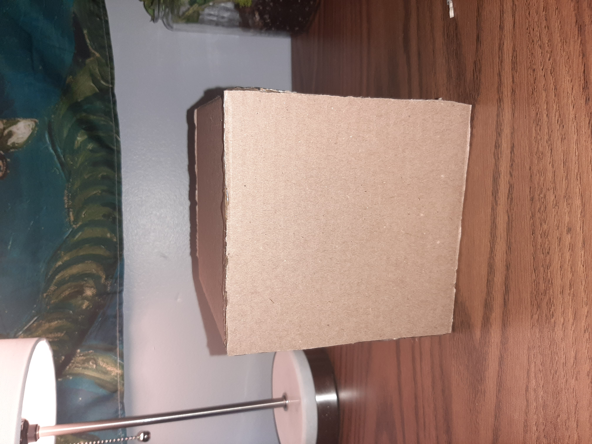
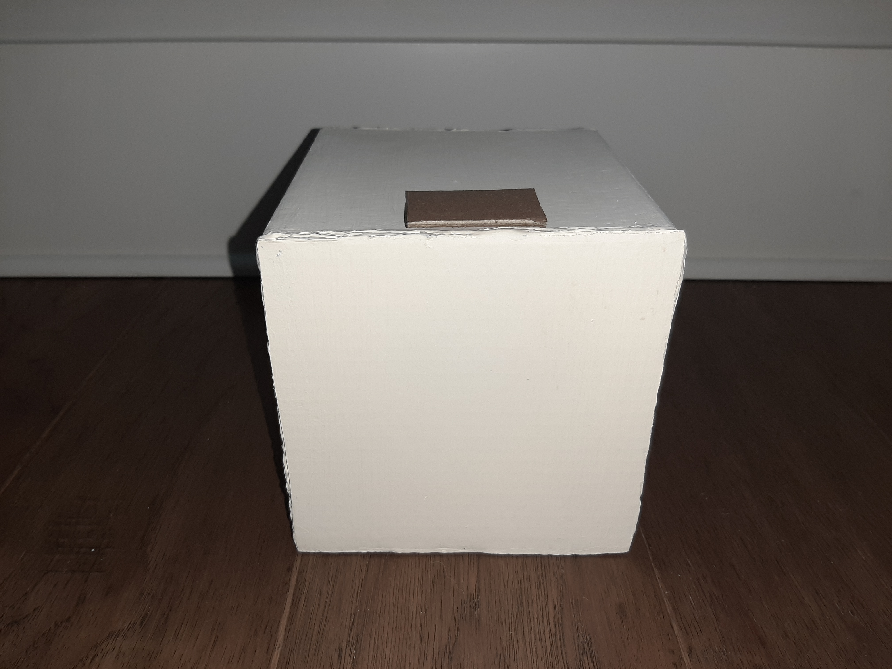
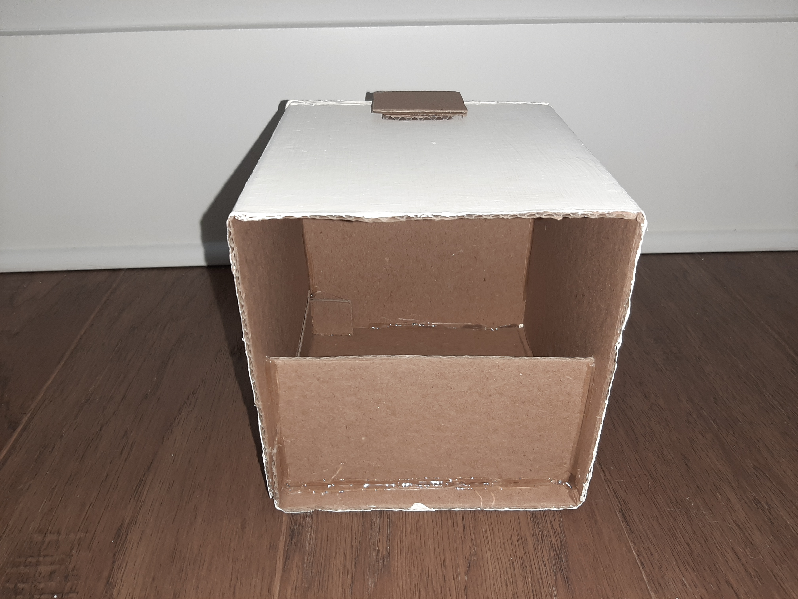
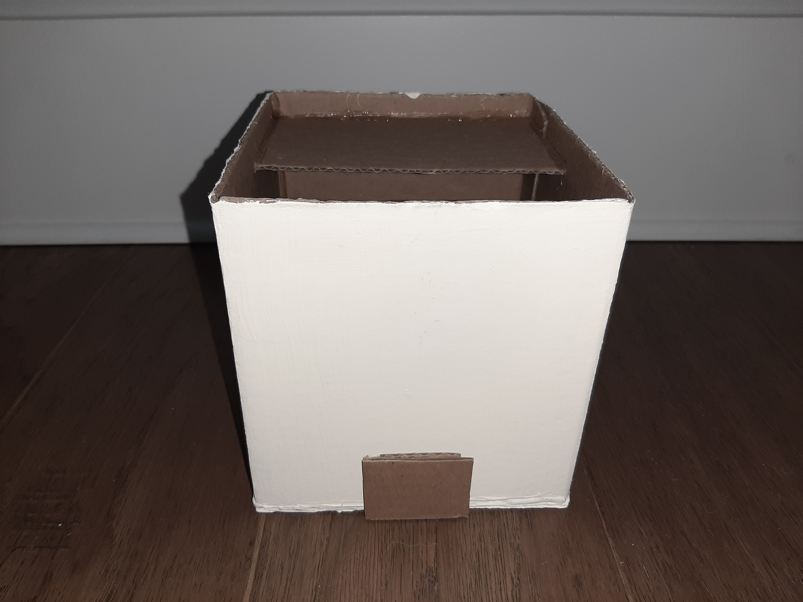
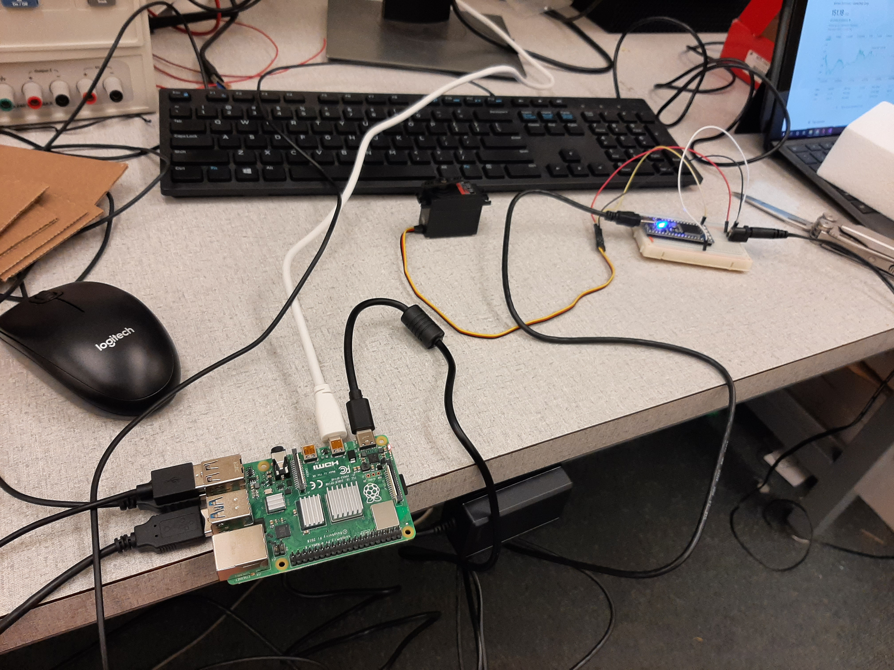
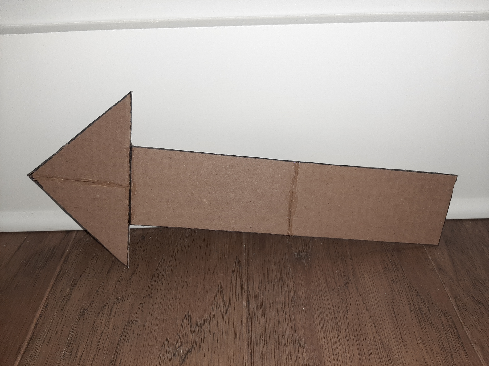
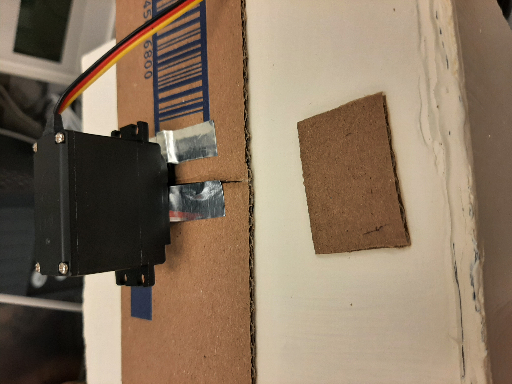
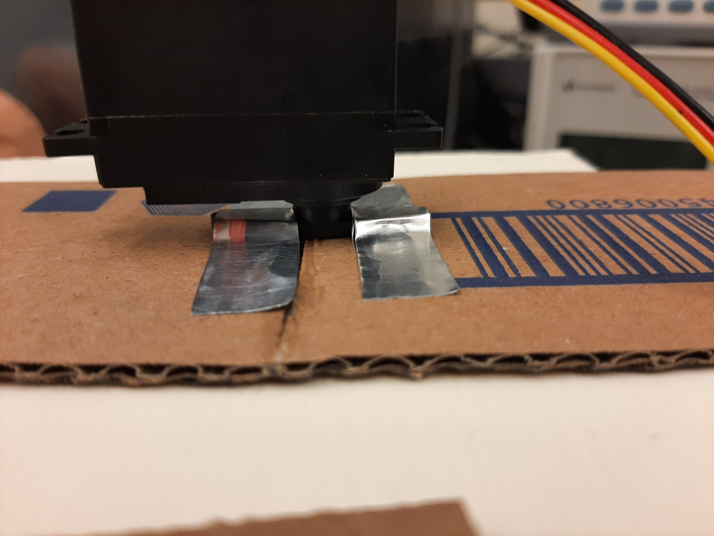

# Stock Trader
__ECE 4180 Spring 2021 Final Project__  
Matthew Tan, Gracen Wallace  

#### Table of Contents
* [Summary](#summary)
* [Parts List](#parts-list)
  * [Electrical Parts](#electrical-parts)
  * [Structural Parts](#structural-parts)
* [Schematics](#schematics)
  * [Network Schematic](#network-schematic)
  * [Hardware Schematics](#hardware-schematics)
* [Software Setup](#software-setup)
  * [Installing & running GUI on the Raspberry Pi](#installing--running-gui-on-the-raspberry-pi)
* [Hardware Setup](#hardware-setup)

## Summary

## Parts List
### Electrical Parts
* [mBED microcontroller & cable](https://www.sparkfun.com/products/9564)
* [Raspberry Pi 4 basic kit](https://www.canakit.com/raspberry-pi-4-basic-kit.html)
* [16GB SD card](https://www.sparkfun.com/products/15051) with [Raspbian OS](https://www.raspberrypi.org/documentation/installation/noobs.md)
* [Raspberry Pi micro-HDMI to HDMI cable](https://www.adafruit.com/product/4302?gclid=Cj0KCQjw1PSDBhDbARIsAPeTqrd1HVeETRREtpcVv8ZM6UxX5sJTC2wGqX1TRvw2GPZ63em6XvAB6BsaAtaoEALw_wcB)
* [DC barrel jack mount](https://www.sparkfun.com/products/10811) 
* [5V wall wart](https://www.sparkfun.com/products/12889)
* [Jumper wires](https://www.sparkfun.com/products/11026)
* [Servo](https://www.sparkfun.com/products/11884)
* HDMI monitor
### Structural Parts
* Styrofoam
* Cardboard
* Adhesive

## Schematics
### Network Schematic

### Hardware Schematics


## Software Setup
### Installing & running GUI on the Raspberry Pi  
1. Install mono for the Pi, to run .NET applications in Linux  
```
sudo apt-get upgrade  
sudo apt-get install mono-complete
```
2. Install nuget for the Pi, to support Nuget .NET packages  
```
sudo apt-get install nuget
```
3. Pull GitHub repository to Pi (be sure to pull while in the /home/pi folder)  
```
git clone https://github.com/gracenw/stock_trader
```
4. Navigate to repository folder  
```
cd stock_trader
```
5. Get a free API key from [IEXCloud](https://iexcloud.io/) and paste into stock_trader/token.txt
6. Load Nuget packages (specifically, RestSharp for HTTP requests)  
```
nuget restore stock_trader.sln  
```
7. Run executable to load GUI on Pi (make sure mBED is already plugged into Pi's USB port)
```
mono /home/pi/stock_trader/stock_trader/bin/Debug/stock_trader.exe
```

## Hardware Setup
### Building the cardboard housing
1. A spare cardboard box to house all of the components
<details>
 <summary>Front view</summary>
 
 
</details>

<details>
 <summary>Back view</summary>
 
 
</details>

2. Painted the cardboard box and glued a small piece of cardboard for the base of the servo
<details>
 <summary>Front view</summary>
 
 
</details>

<details>
 <summary>Back view</summary>
 
 
</details>

<details>
 <summary>Top view</summary>
 
 
</details>

### Connecting all of the components based on hardware schematic
<details>
 <summary>Wiring</summary>
 
 
</details>

### Constructing the cardboard arrow
Cut and glued pieces of cardboard together to form the arrow
<details>
 <summary>Arrow</summary>
 
 
</details>

### Mounting the servo onto the housing
Taped the servo arm onto the small cardboard base on top of the housing
<details>
 <summary>Servo mount</summary>
 
 
</details>

<details>
 <summary>Servo mount close-up</summary>
 
 
</details>
